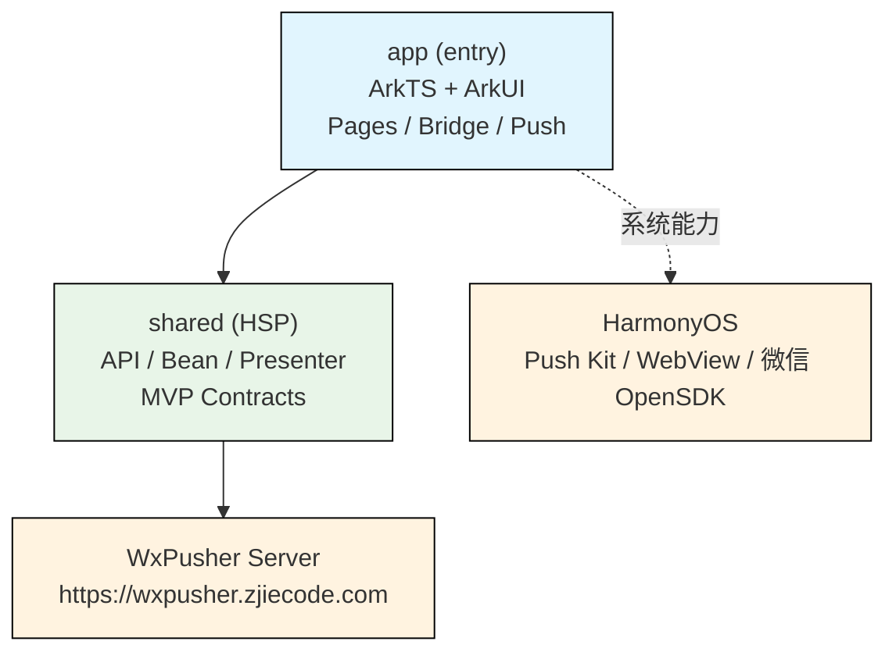

# WxPusher 鸿蒙客户端

WxPusher 是一个实时信息推送平台。本仓库为 WxPusher 在 **HarmonyOS Next**（纯鸿蒙）上的客户端实现，与 [`WxPusher-App`](https://github.com/wxpusher/WxPusher-App)（Android / iOS）功能对齐，使用 ArkTS + ArkUI 开发。

📖 完整的平台文档请参阅：[WxPusher 官方文档](https://wxpusher.zjiecode.com/docs/) | 📥 [下载最新版本 APP](https://wxpusher.zjiecode.com/download/)

---

## 功能特性

- **消息推送**：接收来自 WxPusher 平台的实时消息推送
- **HarmonyOS Push Kit**：直接对接系统级推送服务（Push Kit），无需后台保活即可收消息
- **微信登录**：通过 `@tencent/wechat_open_sdk` 实现微信快捷登录
- **二维码扫描**：扫码关注 Topic、绑定账号等
- **账号管理**：登录、注册、绑定手机、换绑手机、注销
- **消息列表**：浏览推送历史，支持下拉刷新
- **订阅管理**：查看与管理已订阅的 Topic（发送方）
- **WebView**：内嵌 H5 页面（消息详情、市场、协议页等）
- **Deep Link**：支持 `wxpusher://wxpusher.smjcco.com/message` 协议跳转

---

## 技术架构

本项目采用 **app（entry）+ shared（HSP）** 的双模块结构，shared 承载与 Android/iOS 对齐的业务逻辑（API、Bean、Presenter / Contract），app 承载 ArkUI 页面与系统能力实现：



- **Shared 层**：基于 ArkTS（TypeScript），采用 **MVP 架构**（Contract + Presenter），网络层使用系统 `@kit.NetworkKit`，对应 KMP `WxpApiService`、`WxpNetworkService` 的鸿蒙实现
- **App 层**：ArkUI 页面、`AppAbility` 入口、Push 扩展能力（`WxpPushExtensionAbility`）、WebView 桥（`WxpWebBridgeManager`）、微信 OpenSDK 集成

---

## 项目管理

| 分支名                    | 用途说明                                                                                                       |
|--------------------------|----------------------------------------------------------------------------------------------------------------|
| **master**               | 保存最新 WxPusher 鸿蒙版官方线上发布版本                                                                        |
| **release**              | 保存即将发布的下一个版本。新开发的 Feature 可 PR 到 release 分支，release 分支发布后会合并到 master 分支         |


> **贡献代码请提交 PR 到 `release` 分支**，而非 `master` 分支。`release` 分支经过测试验证后，会合并到 `master` 并发布新版本。

鸿蒙 Push Kit 服务对应用 **bundleName 与签名证书** 有强校验，因此**开发者想要使用系统推送功能，必须使用 WxPusher 官方的 bundleName 和签名构建 .app 包**。

一般的开发流程如下：

1. 确定开发的 feature 是否需要合并到 WxPusher 主线 release 分支，开发前可以联系 [WxPusher 客服沟通](https://wxpusher.zjiecode.com/contact.html)；
2. 确定开发需求可以合并到主线，fork 仓库，从 release 拉出分支，开发完成后提 PR 合并到 release 分支；


代码合并到 master / release  分支后，**GitHub Action 会自动使用正式签名构建鸿蒙 .app 包**（见 `.github/workflows/release-harmony-app.yml`），可在 Action 产物或 Release 中下载安装包进行测试使用。

---

## 项目结构

```
wxpusher-app-harmony/
├── AppScope/                              # 应用全局配置（bundleName / versionName / 图标等）
│   ├── app.json5
│   └── resources/
├── app/                                   # entry 模块（ArkTS + ArkUI）
│   └── src/main/
│       ├── module.json5                   # 模块清单（Ability / 权限 / Deep Link）
│       └── ets/
│           ├── appability/                # AppAbility 入口
│           ├── appbackupability/          # 备份扩展能力
│           ├── push/                      # HarmonyOS Push Kit 集成
│           │   ├── WxpPushManager.ets         # Token 获取与刷新
│           │   ├── WxpPushExtensionAbility.ets# Push 扩展能力
│           │   └── WxpPushEventId.ets
│           ├── wxapi/                     # 微信 OpenSDK 集成
│           │   └── WxpWeixinOpenManager.ets
│           ├── webbridge/                 # WebView ↔ ArkTS 桥
│           │   ├── WxpWebBridgeManager.ets
│           │   ├── WxpBridgeContracts.ets
│           │   ├── WxpBridgeMessageParser.ets
│           │   ├── WxpBridgeEmitter.ets
│           │   └── handlers/                  # 各 action handler
│           │       ├── GetLoginInfoBridgeHandler.ets
│           │       ├── WxpGetEnvBaseUrlBridgeHandler.ets
│           │       ├── OpenUrlBridgeHandler.ets
│           │       ├── PayRequestBridgeHandler.ets
│           │       ├── ShowToastBridgeHandler.ets
│           │       ├── SetWebBottomBarBridgeHandler.ets
│           │       └── SetWebOptionMenuBridgeHandler.ets
│           ├── components/                # 公共组件
│           │   └── WxpWebViewComponent.ets
│           ├── common/                    # shared 接口在 app 层的实现
│           │   ├── WxpAppPageServiceImpl.ets
│           │   ├── WxpBaseInfoServiceImpl.ets
│           │   ├── WxpDialogUtilsImpl.ets
│           │   ├── WxpToastUtilsImpl.ets
│           │   ├── WxpLogUtilsImpl.ets
│           │   ├── WxpSaveServiceImpl.ets
│           │   ├── WxpJumpPageUtils.ets
│           │   └── WxpAppGateKeys.ets
│           └── pages/                     # ArkUI 页面
│               ├── Index.ets                  # 启动页
│               ├── MainPage.ets               # 主页（Tab 导航）
│               ├── LoginPage.ets              # 登录页
│               ├── RegisterOrBindPage.ets     # 注册或绑定
│               ├── BindPage.ets               # 绑定手机
│               ├── ChangePhonePage.ets        # 换绑手机
│               ├── AccountDetailPage.ets      # 账号详情
│               ├── RemoveAccountPage.ets      # 注销账号
│               ├── ScanPage.ets               # 扫码
│               ├── WebViewPage.ets            # WebView
│               ├── UserAgreementPage.ets      # 用户协议
│               ├── TestPanelPage.ets          # 测试包专用环境切换面板
│               └── tabs/
│                   ├── MessageListTab.ets         # 消息列表 Tab
│                   ├── ProviderListTab.ets        # 订阅列表 Tab
│                   └── ProfileTab.ets             # 我的 Tab
│
├── shared/                                # 共享业务模块（HSP / library）
│   └── src/main/ets/
│       ├── api/                           # WxpApiService（HTTP 请求）
│       ├── config/                        # WxpConfig（baseUrl / wsUrl / appFeUrl）
│       ├── web/                           # WebView 公共策略
│       │   ├── AppFeVersionManager.ts         # H5 版本管理
│       │   └── WxpWebHostPolicy.ts            # 桥调用 host 白名单
│       ├── base/
│       │   ├── biz/                       # 业务基础（数据 / 页面服务 / Bean）
│       │   │   ├── WxpAppDataService.ts
│       │   │   ├── WxpAppPageService.ts
│       │   │   └── bean/
│       │   └── common/                    # 通用工具（Network / Toast / Loading / Dialog 等）
│       └── page/                          # 各页面的 MVP Contract & Presenter
│           ├── login/
│           ├── messagelist/
│           ├── providerlist/
│           ├── accountdetail/
│           ├── bind/
│           ├── changephone/
│           ├── registerorbind/
│           └── scan/
│
├── .github/                               # GitHub Actions（鸿蒙 SDK 安装 + 签名打包）
│   ├── actions/setup-harmony-sdk/action.yml
│   └── workflows/release-harmony-app.yml
├── build-profile.json5                    # 工程级构建配置（产品 / 签名）
├── oh-package.json5                       # 工程级 ohpm 配置
├── code-linter.json5                      # 代码检查规则
├── hvigorfile.ts                          # hvigor 构建脚本
├── LICENSE                                # 开源协议（中文）
└── LICENSE_EN                             # 开源协议（英文）
```

---

## 技术栈

### Shared 模块（共享业务）

| 技术 | 用途 |
|------|------|
| ArkTS / TypeScript | 跨页面业务逻辑共享 |
| HarmonyOS NetworkKit | HTTP 请求 |
| MVP（Contract + Presenter） | 页面业务架构 |

### App 模块（鸿蒙原生）

| 技术 / 依赖 | 版本 | 用途 |
|------|------|------|
| HarmonyOS SDK | 6.0.2(22) | 编译与运行时 SDK |
| ArkUI | - | 声明式 UI 框架 |
| Push Kit | - | HarmonyOS 系统级推送 |
| WebView (`@kit.ArkWeb`) | - | H5 内嵌容器 |
| `@tencent/wechat_open_sdk` | 1.0.0 | 微信登录 |
| `@ohos/hypium` | 1.0.25 | 单元测试框架 |

---

## 环境要求

- **DevEco Studio** 5.0.13 Release 或更高版本（推荐随鸿蒙 SDK 一起更新）
- **HarmonyOS SDK**：`compatibleSdkVersion` / `targetSdkVersion` = `6.0.2(22)`
- **设备 / 模拟器**：HarmonyOS Next（API 12+ 真机或模拟器）
- **JDK**：17+
- **ohpm**：随 HarmonyOS Command Line Tools 一起提供，镜像建议设置为 `https://ohpm.openharmony.cn/ohpm/`

---

## 快速开始

### 克隆项目

```bash
git clone https://github.com/wxpusher/wxpusher-app-harmony.git
cd wxpusher-app-harmony
```

### 使用 DevEco Studio

1. 用 **DevEco Studio** 打开仓库根目录
2. 等待 `ohpm install` 自动完成
3. 配置自动签名（File → Project Structure → Signing Configs，勾选 *Automatically generate signature*）
4. 选择 HarmonyOS 真机或模拟器后点击运行

### 命令行构建

```bash
# 安装依赖
ohpm install --all

# Debug 构建
hvigorw assembleHap --mode module -p product=default -p buildMode=debug --no-daemon

# Release 构建（需要正式签名）
hvigorw assembleApp --mode project -p product=default -p buildMode=release --no-daemon
```

构建产物位于 `build/outputs/`，CI 流水线会自动打包并归档为 `wxpusher-harmony-vX.Y.Z-<run>.app.zip`。

---

## 架构说明

### MVP 模式（Shared 层）

shared 模块对每个业务页面定义统一契约：

```
Contract (shared/page)
├── IXxxView         # View 接口（由 ArkUI 页面实现）
└── IXxxPresenter    # Presenter 接口

Presenter (shared/page)
└── XxxPresenter     # 业务逻辑实现，通过 WxpApiService 调后端

View (app/pages)
└── XxxPage.ets      # ArkUI 页面，持有 Presenter，响应回调
```

与 KMP 版本的命名 / 数据模型完全对齐，便于跨端代码 review 与协议同步。

### 推送架构（HarmonyOS）

鸿蒙仅依赖系统级 Push Kit：

| 通道 | 适用设备 | 说明 |
|------|----------|------|
| HarmonyOS Push Kit | HarmonyOS Next | 系统级推送，应用无需保活 |

调用关系：

- `WxpPushManager.initPush()` 在 `AppAbility` 启动时调用，先 `pushService.getToken()` 获取 token，再 `pushService.on('tokenUpdate')` 订阅刷新；token 通过 `WxpAppDataService.savePushToken()` 落库并上报。
- `WxpPushExtensionAbility` 处理后台推送回调（点击通知、透传消息等）。

> 注意：HarmonyOS Push Kit 对应用 bundleName 和签名证书有强校验，自行修改 bundleName 后将无法接收系统推送，请配合 [项目管理](#项目管理) 中的 `unofficial_custom` 流程定制。

### WebView 桥协议

`app/webbridge/` 与 KMP `WxpWebBridgeManager`（Android）/ `WxpWebBridgeManager.swift`（iOS）实现完全相同的桥协议：

| Action | Handler | 说明 |
|---|---|---|
| `getLoginInfo` | `GetLoginInfoBridgeHandler` | 获取登录态（deviceToken） |
| `getEnvBaseUrl` | `WxpGetEnvBaseUrlBridgeHandler` | 返回当前后端 / FE 域名 |
| `openUrl` | `OpenUrlBridgeHandler` | 跳转外部链接 |
| `payRequest` | `PayRequestBridgeHandler` | 拉起支付 |
| `showToast` | `ShowToastBridgeHandler` | 显示 Toast |
| `setWebBottomBar` | `SetWebBottomBarBridgeHandler` | 控制底部栏 |
| `setWebOptionMenu` | `SetWebOptionMenuBridgeHandler` | 控制菜单 |

部分高权限 action（如 `payRequest`、`getLoginInfo`）受 `WxpWebHostPolicy` 白名单限制，仅 `wxpusher.zjiecode.com` 等可信 host 调用生效。

---

## 贡献指南

欢迎对 WxPusher 鸿蒙客户端项目进行贡献！请遵循以下流程：

### 1. Fork & Clone

```bash
git clone https://github.com/<your-username>/wxpusher-app-harmony.git
cd wxpusher-app-harmony
```

### 2. 基于 release 分支创建开发分支

```bash
git checkout release
git pull origin release
git checkout -b feature/your-feature-name
```

### 3. 开发和提交

- 遵循现有的代码风格（参考 `code-linter.json5`）和项目结构
- shared 层的改动需保持与 Android / iOS 端命名 / 数据模型一致
- 涉及桥协议的改动需同时确认 H5（`wxpusher-app-fe`）与 Android / iOS 三端是否需要同步
- 提交信息请使用清晰的描述

```bash
git add .
git commit -m "feat: 添加xxx功能"
git push origin feature/your-feature-name
```

### 4. 提交 Pull Request

- 在 GitHub 上创建 Pull Request，**目标分支选择 `release`**
- 描述改动内容和测试情况（建议附上真机截图 / 录屏）
- 等待代码审查和合并

### 注意事项

- 提交的贡献代码需遵守本项目的[开源协议](#开源协议)
- 请勿提交包含敏感信息的文件（签名证书 `.p12` / `.cer` / `.p7b`、`local.properties` 等）—— 这些文件已在 `.gitignore` 与 GitHub Secrets 中处理
- 涉及 Push Kit 的改动，请确保在已配置的 HarmonyOS 真机上验证 token 注册与消息接收流程

---

## 开源协议

本项目采用 **四川思明今创科技有限公司客户端开源协议**，与 Android / iOS 客户端保持一致。主要条款：

- ✅ 可自由查看和审计全部源代码
- ✅ 可修改和编译用于个人/内部非商业用途
- ✅ 可向本项目提交代码贡献
- ✅ 可正常传播分发官方未修改版本
- ❌ 不得用于商业盈利活动
- ❌ 不得分发修改后的非官方版本
- ❌ 不得基于本项目开发竞品进行商业化

完整协议请参阅 [LICENSE](./LICENSE)（中文）/ [LICENSE_EN](./LICENSE_EN)（英文）。

---

## 下载安装

前往 [WxPusher APP 下载页](https://wxpusher.zjiecode.com/download/) 获取最新版本：

- **HarmonyOS**：扫码下载 `.app` 安装包，或在 AppGallery 搜索「WxPusher消息推送平台」

---

## 相关链接

- [WxPusher 官方文档](https://wxpusher.zjiecode.com/docs/)
- [WxPusher 官网](https://wxpusher.zjiecode.com)
- [APP 下载](https://wxpusher.zjiecode.com/download/)
- [Android / iOS 客户端](https://github.com/wxpusher/WxPusher-App)
